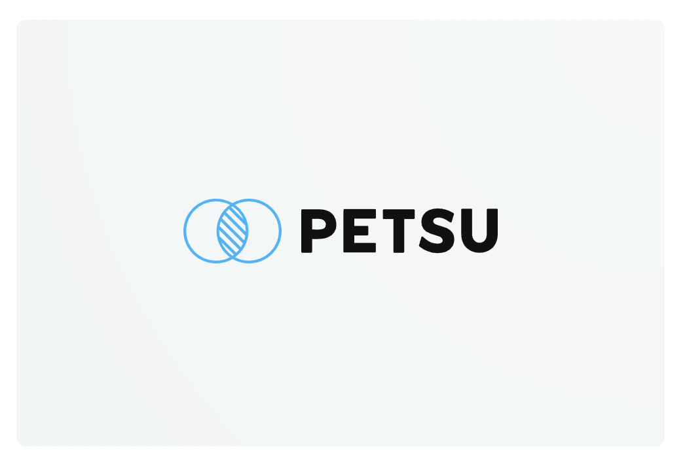
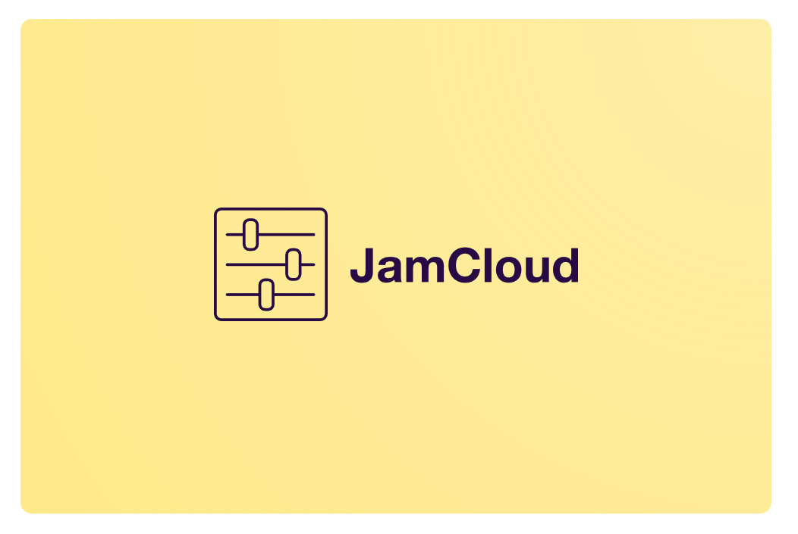
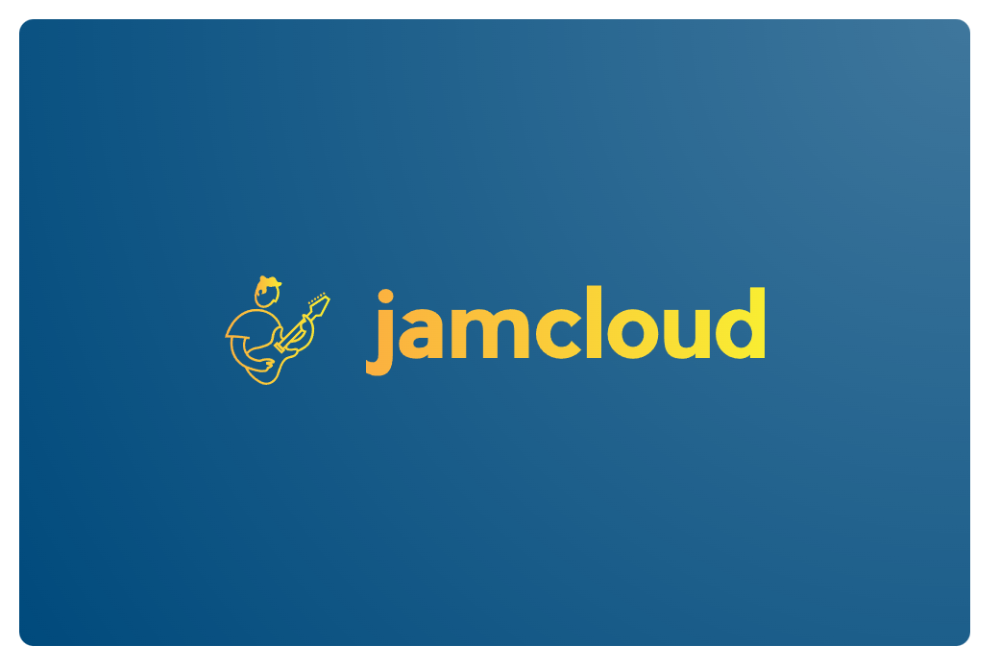
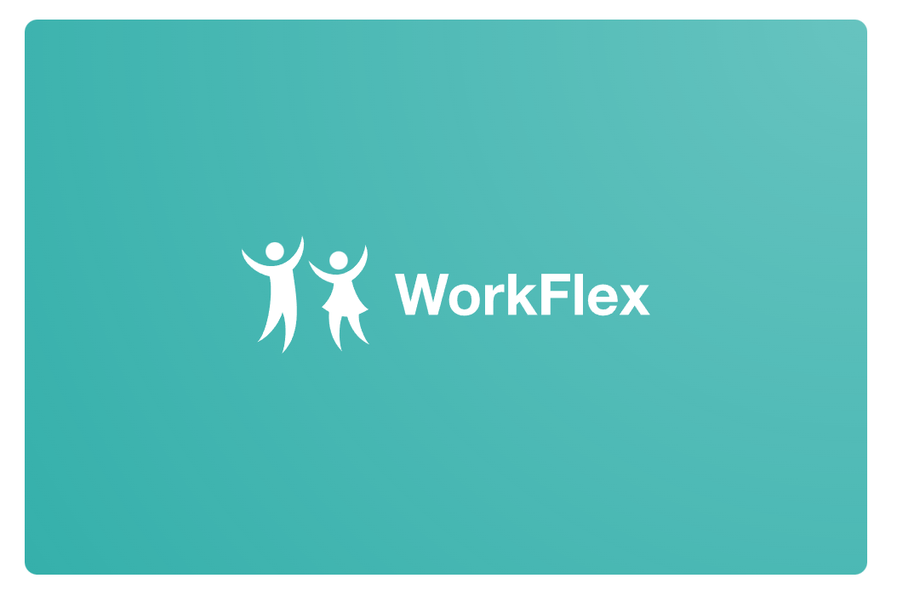
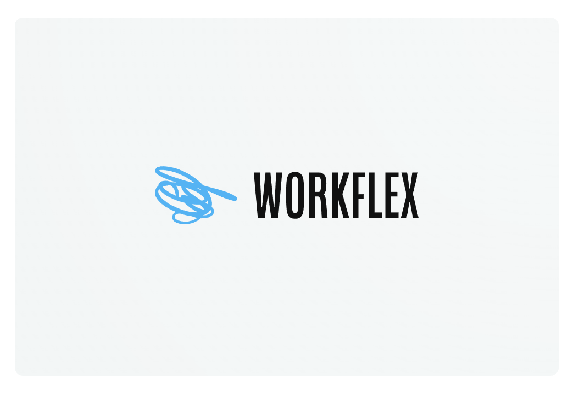
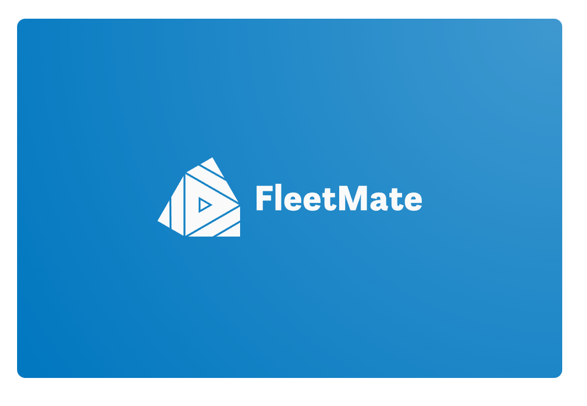
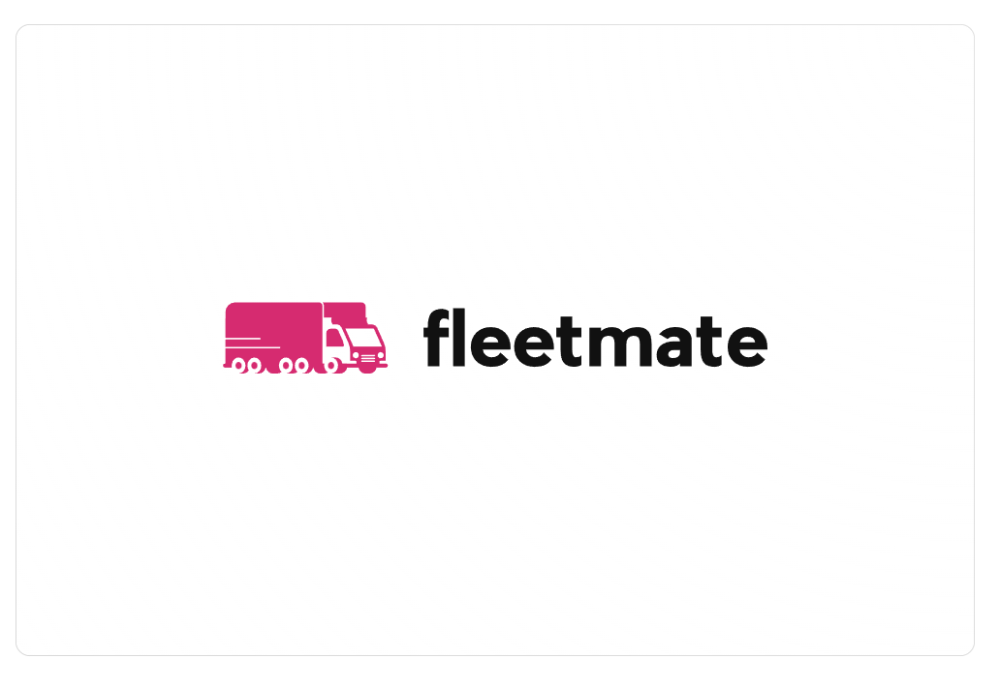
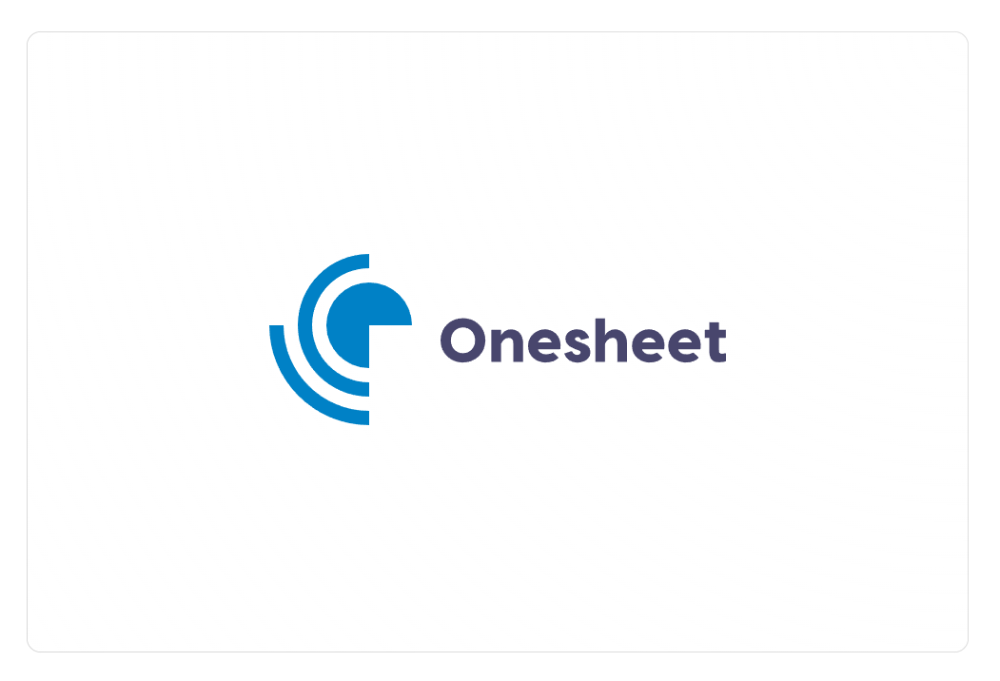
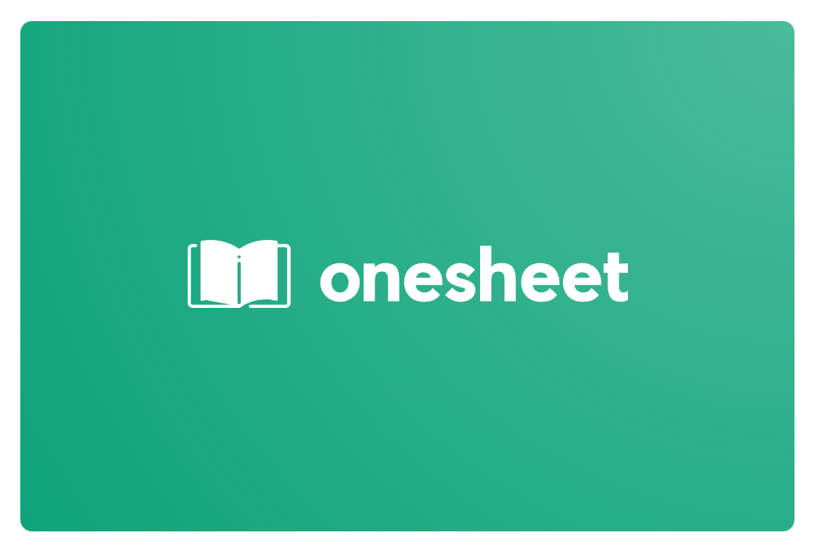

# No Ipsum

Free 

# Petsu

    
    

**Your Personal Petsitter Solution**

Petsu is an innovative pet-sitting management system that helps pet owners simplify the process of finding and organizing sitters, while providing a safe and secure platform for sitters to interact with potential clients.

**Effortless Management**

Get started quickly and easily with our intuitive user interface

- Sitter Database: A comprehensive list of pet-sitters available for hire.
- Scheduling Features: Automated scheduling tools to make booking easier.
- Secure Platform: Encrypted platform for secure communication.

# JamCloud

**Music Creation in the Cloud**

JamCloud is a revolutionary online music recording studio that allows users to record, mix, and produce professional-level music tracks from any device, anytime, anywhere.

**Unlimited Possibilities**

Unlock endless possibilities with our powerful recording platform.

- Record Anywhere: Record, mix, and produce music from any device.
- Cloud Storage: Store music files securely in the cloud.
- Professional Tools: Access to professional-level recording and mixing tools.

**Best-in-Industry tooling**

JamCloud offers reliable and comprehensive recording tools, giving users the same professional-level experience they expect from in-studio recording.

- Multitrack Recording
- Dynamic EQ
- Noise Reduction

# WorkFlex

**Effortless Online Scheduling**

WorkFlex is a comprehensive employee scheduling platform that enables businesses to manage staff and shift rotations with ease, ensuring that employees get the most out of their workdays.

**100% Seamless Experience**

Enjoy effortless integration with our custom built experience

- Shift Rotation: Easily manage employee shift rotations.
- Calendar Syncing: Automatically sync calendars with shift rotations.
- Real-time Notifications: Receive real-time notifications when changes are made.

**Always in reach**

Helps users stay on top of time-sensitive data in real-time, helping them make informed decisions and stay organized day-in-day out.

- Monitor capacity
- Analyze trends
- Generate reports

# FleetMate

**Your Logistics, Our Priority**

FleetMate is an advanced vehicle fleet management system that allows business owners to monitor and manage their fleets from one centralized dashboard, ensuring that all vehicles are running smoothly and efficiently.

**Secure and Reliable**
Rely on our secure and reliable infrastructure for your logistics needs

- Centralized Dashboard: Monitor and manage fleets from one dashboard.
- Vehicle Tracking: Track and locate vehicles in real-time.
- Maintenance Logs: Automated maintenance logs to keep track of repairs.

**Enhanced by Hardware**

Intergrates with a range of third-party sensors to provide precise data, enabling drivers to monitor and adjust metrics for maximum efficiency and safety.

- Full GPS tracking
- Real-time sensors
- Digital video feed

# Onesheet

**Stupidly Simple Accounting**

Onesheet is an intuitive online accounting software that provides users with an easy way to track financial information, manage expenses, and generate detailed reports with just a few clicks.

**Range of Powerful Features**

Accounting software is the perfect solution for businesses! It's an all-in-one tool that helps you manage finances, track expenses, and generate reports with ease.

- Financial Tracking: Track financial information in real-time.
- Expense Management: Automatically track and manage expenses.
- AI Automation: Generate detailed financial reports with one click.

**Expert AI Analytics**

Modern accounting software is powered by AI, giving businesses the ability to streamline their finances and gain valuable insights from their financial data.

- Predictive analytics
- Natural language processing
- Highly configuranble